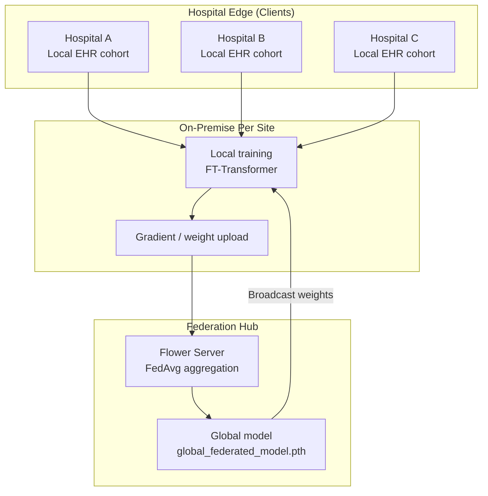
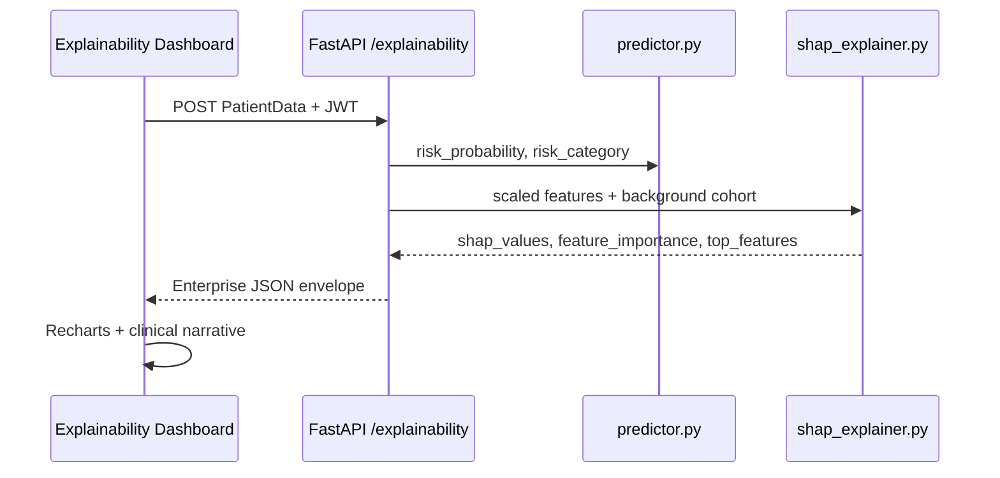
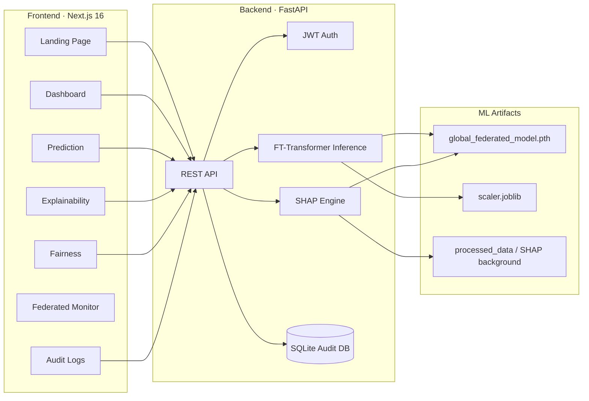

<div align="center">

# FedHealth AI

### Federated Explainable Healthcare AI Platform

**Privacy-preserving cardiovascular risk intelligence across hospital networks — with SHAP explainability, bias monitoring, and enterprise compliance tooling.**

<br />

[](https://fastapi.tiangolo.com/)
[](https://pytorch.org/)
[](https://nextjs.org/)
[](https://flower.dev/)
[](https://github.com/shap/shap)
[](https://www.docker.com/)

[Live Demo](#-quick-start) · [Architecture](#-architecture) · [API](#-api-endpoints) · [Roadmap](#-roadmap) · [Contributing](#-contributing)

</div>

---

## Overview

**FedHealth AI** is an end-to-end platform for **federated cardiovascular risk prediction** in multi-hospital environments. Hospitals train a shared **FT-Transformer** model locally without exporting raw patient records; the global model powers real-time predictions, **SHAP-based explanations**, fairness audits, and immutable prediction logs for clinical governance.

Built for **healthcare AI engineers**, **clinical informatics teams**, and **hackathon / portfolio** audiences who need a credible story at the intersection of **privacy, explainability, and regulated ML**.

| Pillar | What it delivers |
|--------|------------------|
| **Federated learning** | Cross-site model training via Flower (FedAvg) — data stays at the hospital |
| **Explainable AI** | Live SHAP attributions per patient via FastAPI + interactive dashboard |
| **Responsible AI** | Fairness monitoring, bias indicators, and audit trails |
| **Enterprise UX** | Production-oriented Next.js dashboards and Docker Compose deployment |

---

## Key Features

### Clinical & ML

- **Cardiovascular risk prediction** — 11-feature patient profile (vitals, lipids, lifestyle)
- **FT-Transformer** global model with federated aggregation across hospital cohorts
- **Real-time SHAP explainability** — feature importance, top drivers, risk category
- **ROC-AUC–driven monitoring** — dashboard KPIs and training round tracking

### Platform & Governance

- **JWT-secured REST API** — role-based demo users (admin, doctor, analyst)
- **Audit logging** — SQLite-backed prediction history for compliance review
- **Fairness dashboard** — demographic parity, protected-attribute comparison tables
- **Federated ops monitor** — hospital client status, aggregation pipeline, latency metrics

### Developer Experience

- **Docker Compose** — one-command frontend + backend stack
- **OpenAPI docs** — interactive Swagger at `/docs`
- **TypeScript frontend** — Recharts, Framer Motion, Tailwind CSS enterprise UI

---

## Federated Learning Pipeline

FedHealth AI trains a **single global model** from distributed hospital datasets without centralizing PHI.



**How it works**

1. Each hospital holds preprocessed cohort data (`hospital_a.csv`, `hospital_b.csv`, …).
2. **Flower clients** run local epochs on the FT-Transformer and send updates to the server.
3. The **FedAvg** strategy aggregates client weights into a global checkpoint.
4. The API loads `models/global_federated_model.pth` for inference — no raw data leaves the institution.

> Training scripts: `backend/federated/server.py`, `backend/federated/client.py`, `backend/training/train.py`

---

## SHAP Explainability

Every prediction can be decomposed with **SHAP (SHapley Additive exPlanations)** so clinicians see *why* a patient is high or low risk.



**Response highlights**

- `shap_values` — per-feature attribution map  
- `feature_importance` — ranked by absolute SHAP impact  
- `top_features` — primary drivers with `increases_risk` / `decreases_risk`  
- Shared risk scores from the same `predict()` path as `/predict` for consistency  

> Implementation: `backend/explainability/shap_explainer.py`, `backend/api/explainability_service.py`

---

## Architecture



### Repository structure

```
federated-healthcare-ai/
├── backend/
│   ├── api/                 # FastAPI app, predictor, schemas
│   ├── auth/                # JWT bearer, demo users
│   ├── database/            # SQLAlchemy models & CRUD
│   ├── explainability/      # SHAP explainer module
│   ├── federated/           # Flower server & clients
│   ├── fairness/            # Fairness evaluation scripts
│   ├── models/              # Global federated weights (.pth)
│   ├── scalers/             # sklearn StandardScaler
│   ├── processed_data/      # Hospital splits + test cohort
│   ├── Dockerfile
│   └── requirements.txt
├── frontend/
│   ├── app/                 # Next.js App Router pages
│   ├── lib/api.ts           # NEXT_PUBLIC_API_URL helper
│   └── Dockerfile
├── docker-compose.yml
└── .env.example
```

---

## Tech Stack

| Layer | Technologies |
|-------|----------------|
| **Frontend** | Next.js 16, React 19, TypeScript, Tailwind CSS 4, Recharts, Framer Motion, Axios |
| **Backend** | FastAPI, Uvicorn, Pydantic, SQLAlchemy, python-jose (JWT) |
| **ML / FL** | PyTorch, FT-Transformer, Flower (Flwr), scikit-learn, SHAP, NumPy, pandas |
| **Data** | SQLite (audit logs), joblib scalers, CSV hospital cohorts |
| **DevOps** | Docker, Docker Compose, multi-stage Python slim images |

---

## Screenshots

> Add captures to `docs/images/` and replace placeholders below.

| Landing & brand | Risk dashboard |
|-----------------|----------------|
|  |  |
| *Hero · federated + explainable positioning* | *KPIs · ROC-AUC · federated rounds* |

| SHAP explainability | Federated monitor |
|---------------------|-------------------|
|  |  |
| *Live API · feature impact chart* | *Hospital clients · aggregation status* |

| Fairness & bias | Prediction workflow |
|-----------------|---------------------|
|  |  |
| *Demographic parity · compliance scorecards* | *Patient form · risk output* |

---

## Quick Start

### Prerequisites

- **Python 3.12+** with virtual environment  
- **Node.js 20+** and npm  
- Trained artifacts: `backend/models/global_federated_model.pth`, `backend/scalers/scaler.joblib`  
- (Optional) **Docker** & **Docker Compose**

### 1. Clone the repository

```bash
git clone https://github.com/YOUR_USERNAME/federated-healthcare-ai.git
cd federated-healthcare-ai
```

### 2. Backend setup

```bash
cd backend
python -m venv .venv

# Windows
.venv\Scripts\activate
# macOS / Linux
source .venv/bin/activate

pip install -r requirements.txt
pip install torch --index-url https://download.pytorch.org/whl/cpu

cd api
uvicorn app:app --reload --host 0.0.0.0 --port 8000
```

API root: [http://localhost:8000](http://localhost:8000)  
Interactive docs: [http://localhost:8000/docs](http://localhost:8000/docs)

### 3. Frontend setup

```bash
cd frontend
npm install

# Optional: frontend/.env.local
# NEXT_PUBLIC_API_URL=http://localhost:8000

npm run dev
```

App: [http://localhost:3000](http://localhost:3000)

### 4. Authenticate (demo users)

| Username | Password | Role |
|----------|----------|------|
| `admin` | `admin123` | admin |
| `doctor` | `doctor123` | doctor |
| `analyst` | `analyst123` | analyst |

Obtain a token via `POST /login`, then store `access_token` in browser `localStorage` as `token` (used by dashboard pages).

```bash
curl -X POST "http://localhost:8000/login?username=admin&password=admin123"
```

---

## Docker Deployment

Full stack with **frontend on port 3000** and **backend on port 8000**.

```bash
# From repository root
cp .env.example .env

docker compose up --build
```

| Service | URL |
|---------|-----|
| Frontend | http://localhost:3000 |
| Backend API | http://localhost:8000 |
| OpenAPI | http://localhost:8000/docs |

**Compose highlights**

- Volume mounts for `models/`, `scalers/`, `processed_data/`, `healthcare_ai.db`, `reports/`
- Environment variables: `JWT_SECRET_KEY`, `NEXT_PUBLIC_API_URL`, `CORS_ORIGINS`
- Backend healthcheck gates frontend startup

**Production tips**

- Change `JWT_SECRET_KEY` in `.env` — never use defaults in production  
- Place TLS termination behind nginx / cloud load balancer  
- First `/explainability` call may take 15–30s while SHAP initializes  

---

## API Endpoints

| Method | Endpoint | Auth | Description |
|--------|----------|------|-------------|
| `GET` | `/` | No | Health / welcome message |
| `POST` | `/login` | No | Issue JWT (`username`, `password` query params) |
| `POST` | `/predict` | JWT | Cardiovascular risk prediction + audit log |
| `POST` | `/explainability` | JWT | SHAP explanation + risk scores |
| `GET` | `/logs` | JWT | Prediction audit trail |

### Patient payload (`PatientData`)

```json
{
  "age": 62,
  "gender": 1,
  "height": 170,
  "weight": 90,
  "ap_hi": 148,
  "ap_lo": 92,
  "cholesterol": 3,
  "gluc": 2,
  "smoke": 1,
  "alco": 0,
  "active": 0
}
```

### Example: explainability

```bash
TOKEN="your_jwt_here"

curl -X POST http://localhost:8000/explainability \
  -H "Authorization: Bearer $TOKEN" \
  -H "Content-Type: application/json" \
  -d '{
    "age": 62, "gender": 1, "height": 170, "weight": 90,
    "ap_hi": 148, "ap_lo": 92, "cholesterol": 3, "gluc": 2,
    "smoke": 1, "alco": 0, "active": 0
  }'
```

<details>
<summary><strong>Sample explainability response</strong></summary>

```json
{
  "status": "success",
  "data": {
    "risk_probability": 0.87,
    "risk_category": "High Risk",
    "shap_values": { "ap_hi": 0.24, "cholesterol": 0.19, "age": 0.16 },
    "feature_importance": [
      { "feature": "ap_hi", "shap_value": 0.24, "abs_importance": 0.24, "rank": 1 }
    ],
    "top_features": [
      { "feature": "ap_hi", "shap_value": 0.24, "direction": "increases_risk" }
    ],
    "model": { "name": "FTTransformer", "version": "v1.2.4", "framework": "PyTorch" }
  }
}
```

</details>

---

## Roadmap

- [ ] **OAuth2 / SSO** — hospital identity provider integration  
- [ ] **FHIR-compatible ingestion** — SMART on FHIR patient resources  
- [ ] **Async explainability queue** — Redis + worker for sub-second API UX  
- [ ] **Differential privacy dashboards** — ε, δ tracking per federated round  
- [ ] **Multi-model registry** — versioned deployments with A/B clinical validation  
- [ ] **Real-time federated streaming** — live round metrics from Flower cluster  
- [ ] **HIPAA audit export** — PDF / CSV compliance packs for IRB review  
- [ ] **Kubernetes Helm chart** — GKE / AKS hospital edge reference architecture  

---

## Contributing

We welcome contributions from the healthcare ML and open-source communities.

1. **Fork** the repository  
2. **Create** a feature branch: `git checkout -b feature/amazing-feature`  
3. **Commit** your changes: `git commit -m 'Add amazing feature'`  
4. **Push** to the branch: `git push origin feature/amazing-feature`  
5. **Open** a Pull Request  

**Guidelines**

- Follow existing code style (TypeScript / Python type hints where applicable)  
- Add tests for new API routes or critical ML utilities when possible  
- Do not commit PHI, secrets, or production model weights with sensitive metadata  
- Update README / OpenAPI descriptions for user-facing changes  

**Good first issues**

- Wire fairness dashboard to live backend metrics  
- Centralize login flow and token refresh in the frontend  
- Add `docs/images/` screenshots and CI badge pipeline  

---

## License

This project is released under the **MIT License** — see [LICENSE](LICENSE) for full text.

```
MIT License — Copyright (c) 2026 FedHealth AI Contributors
```

You are free to use, modify, and distribute this software with attribution. **This codebase is a research and demonstration platform — not a medical device.** Always validate models and workflows with qualified clinical and regulatory review before any production healthcare use.

---

## Acknowledgments

- [Flower](https://flower.dev/) — federated learning framework  
- [SHAP](https://github.com/shap/shap) — model explainability  
- [FastAPI](https://fastapi.tiangolo.com/) — modern Python API layer  
- Cardiovascular risk modeling inspired by public health analytics cohorts  

---

<div align="center">

**Built with privacy-first federated learning and explainable AI for safer healthcare decisions.**

⭐ Star this repo if it helped your hackathon, portfolio, or research project.

</div>
